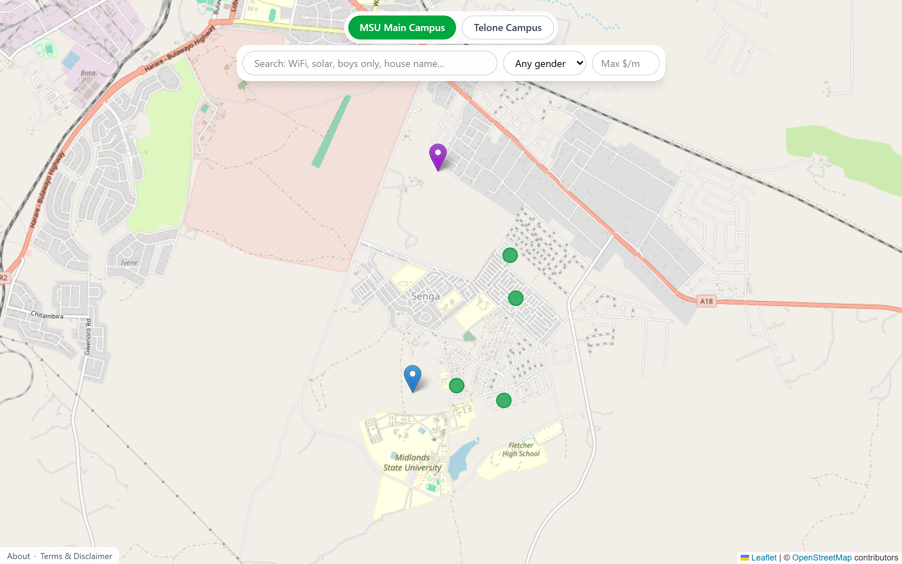
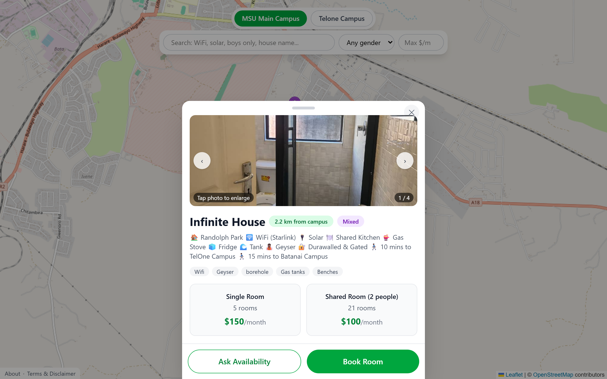
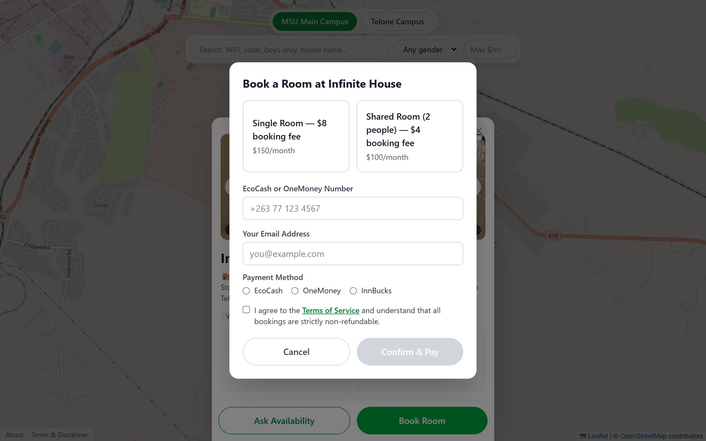
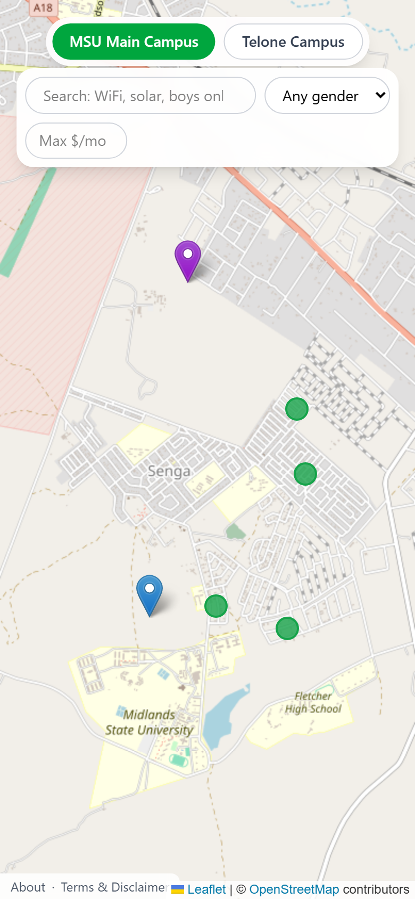

# Mybase

**Student accommodation, mapped.** Mybase helps students in Gweru, Zimbabwe find and book off-campus boarding houses near Midlands State University (MSU) and Telone campuses — browse listings on a map, filter by what matters, chat with the team, and pay the booking fee by mobile money.

🌐 Live at **[mybasehousing.co.zw](https://mybasehousing.co.zw)**

> ⚠️ Mybase is an independent, private platform. It has **no affiliation with Midlands State University (MSU)**. All listings are managed independently by private landlords.

---

## Screenshots



| House details & photos | Booking & mobile-money payment |
| --- | --- |
|  |  |

<p align="center"></p>

---

## Features

- **Interactive map** — full-screen Leaflet map centred on Gweru with a pin for every listed house (green = rooms available, red = full) and markers for both campuses.
- **Search & filters** — free-text search (house name, amenities like "WiFi" / "solar", gender phrasing) plus gender-policy and max-price filters, applied live to the map pins.
- **House details** — a bottom-sheet with a photo carousel, a full-screen lightbox for complete images, distance-from-campus, gender/amenity badges, and per-room-type availability and pricing.
- **Mobile-money bookings** — pay the booking fee via **Paynow** (EcoCash, OneMoney, or InnBucks), with a live status flow and an on-screen receipt code.
- **Live availability** — house availability updates in real time across all open browsers via Supabase Realtime.
- **In-app chat** — Tawk.to widget; "Ask Availability" opens chat pre-tagged with the house name (no WhatsApp).
- **Admin dashboard** — email/password login to add, edit, and delete houses (with photo upload), toggle full/available, and review all bookings.
- **Installable PWA** — add to home screen, custom app icon, offline-friendly app shell.

## Tech stack

| Layer | Technology |
| --- | --- |
| Frontend | React 19, Vite, React Router, Tailwind CSS v4 |
| Map | Leaflet + react-leaflet (OpenStreetMap tiles) |
| Database / Auth / Storage / Realtime | [Supabase](https://supabase.com) (PostgreSQL) |
| Payments | [Paynow](https://paynow.co.zw) (Zimbabwe mobile money) |
| Serverless API | Vercel Functions (Node.js) in `api/` |
| Chat | Tawk.to |
| Hosting | Vercel |

> There is **no Python/Flask/Django backend**. The React app talks to Supabase directly from the browser; the only server-side code is the Node serverless functions in `api/` that handle Paynow payments securely.

## Project structure

```
├── api/                      # Vercel serverless functions (Node)
│   ├── paynow-initiate.js    #   start a payment, create a pending booking
│   ├── paynow-poll.js        #   poll payment status (used by the browser)
│   └── paynow-result.js      #   Paynow server-to-server webhook
├── public/                   # PWA manifest, service worker, icons
├── scripts/
│   └── dev-api.mjs           # local stand-in for Vercel's runtime (serves api/ in dev)
├── src/
│   ├── components/           # CampusToggle, FilterBar, HouseModal, BookingModal, TawkChat, SiteFooter
│   ├── lib/                  # supabase client, room-type config
│   ├── pages/                # MapPage, AdminPage, AboutPage, TermsPage
│   ├── App.jsx               # routes
│   └── main.jsx              # entry + service-worker registration
├── supabase/                 # SQL migrations / fixes (run manually in the Supabase SQL editor)
└── vercel.json               # SPA rewrite so client routes work in production
```

## Getting started

### Prerequisites

- Node.js 18+
- A [Supabase](https://supabase.com) project
- A [Paynow](https://paynow.co.zw) merchant account (for live payments)

### 1. Install

```bash
npm install
```

### 2. Environment variables

Create a `.env` file in the project root (it is gitignored — never commit it):

```bash
# Supabase
VITE_SUPABASE_URL=https://<your-project>.supabase.co
VITE_SUPABASE_ANON_KEY=<your-anon-key>
SUPABASE_SERVICE_KEY=<your-service-role-key>   # server-side only — NO VITE_ prefix

# Tawk.to live chat
VITE_TAWKTO_ID=<propertyId>/<widgetId>

# Paynow
PAYNOW_INTEGRATION_ID=<your-integration-id>
PAYNOW_INTEGRATION_KEY=<your-integration-key>
PAYNOW_RESULT_URL=https://<your-domain>/api/paynow-result
PAYNOW_RETURN_URL=https://<your-domain>/booking-complete
```

> **Security:** the service-role key must **never** carry the `VITE_` prefix — anything prefixed `VITE_` is bundled into the public browser build. It is used only by the serverless functions in `api/`.

### 3. Database

Set up the `houses` and `bookings` tables in Supabase, then run the SQL files in [`supabase/`](supabase/) (in order) in the Supabase SQL Editor to apply the room-size, filter, and constraint migrations. Also create a public **`house-photos`** storage bucket for listing images.

### 4. Run locally

```bash
npm run dev
```

This runs Vite **and** a small local server (`scripts/dev-api.mjs`) that serves the `api/` functions on port 3001 (proxied at `/api`), so payments work in development the same way they do on Vercel. App runs at `http://localhost:5173`.

## Scripts

| Command | Description |
| --- | --- |
| `npm run dev` | Start Vite + local API server |
| `npm run build` | Production build to `dist/` |
| `npm run preview` | Preview the production build |
| `npm run lint` | Run ESLint |

## Deployment

Deployed on **Vercel**. Import the repo, set all the environment variables above in the Vercel project settings, and every push to `main` auto-deploys. `vercel.json` adds a SPA rewrite so client-side routes (e.g. `/admin`) resolve, and the `api/` folder is picked up automatically as serverless functions.

**Paynow note:** a Paynow integration is single-currency — the integration ID determines whether charges are in USD or ZWG. Set `PAYNOW_RESULT_URL` to your deployed domain so Paynow's payment webhook can reach the app.

## License

Private project. All rights reserved.
